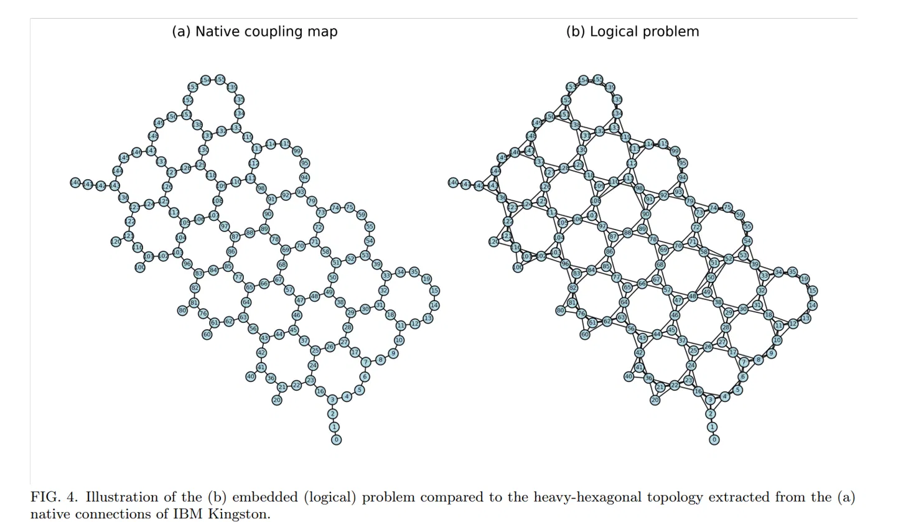
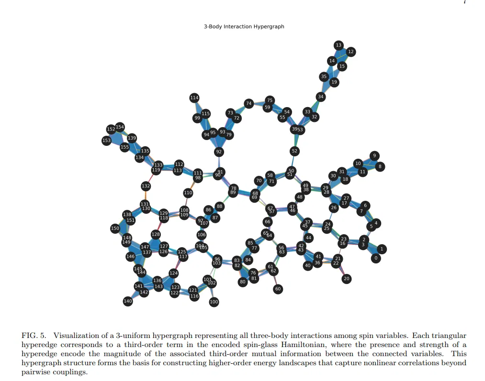
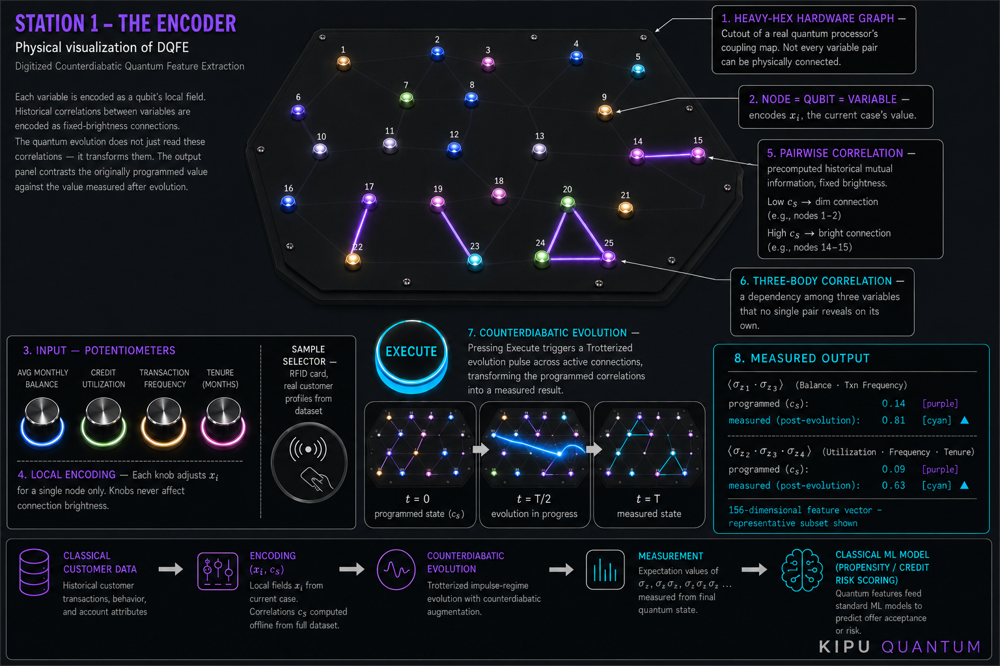

# Estación 1 — El Encoder

### Documento explicativo — cómo funciona y cómo se construye

**Proyecto:** Demo físico interactivo — Digitized Counterdiabatic Quantum Feature Extraction (DQFE)
**Contexto:** Stand NTT Data - Kipu Quantum, Q2B Copenhagen
**Alcance:** primera estación del recorrido ("el Encoder"). No cubre la Estación 2 (surrogates).

---

## 1. Objetivo del demo

> **Dos variables de un dataset pueden parecer no tener relación entre sí, y sin embargo compartir una correlación fuerte que solo aparece al procesarlas mediante una evolución cuántica — una correlación que un análisis clásico simple no muestra.**

Todo el diseño físico de esta estación existe para hacer *visible* esa idea, no para simular con precisión un computador cuántico. Es una traducción física y honesta del mecanismo del paper, no una réplica funcional del hardware.

**Paper de referencia:** *Digitized Counterdiabatic Quantum Feature Extraction*, Simen et al., Kipu Quantum (arXiv:2510.13807).

---

## 2. Resumen conceptual y convención visual

El paper codifica un vector de datos clásico $x = (x_1, ..., x_n)$ en un Hamiltoniano de espines:

$$H(x) = \sum_{i=1}^n x_i \sigma^z_i + \sum_{k=2}^{K} \sum_{S \in G^{(k)}} c_S \prod_{i \in S} \sigma^z_i$$

Dos piezas distintas conviven en esta ecuación, y esa distinción es el corazón del demo:

| Símbolo | Qué es | ¿Cambia con cada visita? |
|---|---|---|
| $x_i$ | El valor de la variable $i$ en el caso puntual que se está mirando ahora | **Sí** — es el dato de entrada |
| $c_S$ | La información mutua histórica entre las variables del subconjunto $S$ (2 o 3 variables), calculada sobre todo el dataset | **No** — es una propiedad fija del dataset, precomputada una sola vez |

Tras construir $H(x)$, el sistema lo evoluciona mediante una dinámica counterdiabatic trotterizada en régimen de impulso, y mide valores esperados $\langle\sigma^z_i\rangle$, $\langle\sigma^z_i\sigma^z_j\rangle$, $\langle\sigma^z_i\sigma^z_j\sigma^z_k\rangle$. **El valor medido no es igual al $c_S$ programado** — es una versión transformada por la evolución. Ese contraste es el argumento de valor central de todo el sistema.

### Convención de color (estándar para todo material visual del demo)

| Color | Significa | Aplica a |
|---|---|---|
| **Morado** (#7F77DD aprox.) | Estático, programado, precomputado del histórico | Conexiones en su estado inicial ($c_S$), perillas de input |
| **Cian** (#00E5FF aprox.) | Resultado, medido, posterior a la evolución | Panel de salida, conexiones tras ejecutar |

No mezclar estos significados en ninguna pieza gráfica futura del stand — esa consistencia es lo que hace que un visitante entienda el sistema sin que se le explique en voz.

---

## 3. Arquitectura general — las 8 capas del sistema

| # | Capa | Elemento físico | Qué representa |
|---|------|------------------|-----------------|
| 1 | Topología | Tablero con geometría heavy-hex | Grafo de conectividad real del hardware cuántico (IBM Kingston) |
| 2 | Nodos | LEDs individuales | Qubits — uno por variable del dataset |
| 3 | Input | Selector de muestra + 4 perillas "hero" | El vector de datos $x$ de un caso real |
| 4 | Codificación local | Brillo individual de cada nodo | Término $x_i \sigma^z_i$ |
| 5 | Correlación 2 cuerpos | Fibra óptica entre pares de nodos (morado → cian) | Término $c_S$, $\vert S\vert=2$, luego valor medido |
| 6 | Correlación 3 cuerpos | Triángulos de fibra entre tríos de nodos | Término $c_S$, $\vert S\vert=3$ |
| 7 | Evolución | Botón "Execute" + animación de pulso | La dinámica counterdiabatic trotterizada |
| 8 | Salida | Pantalla / panel de medición | Contraste programado vs. medido |

### Estructura narrativa de 3 fases

Para explicar el demo en voz a un visitante, conviene agrupar las 8 capas en 3 momentos:

1. **Hardware + estado programado** (t=0): el problema se cargó, y las correlaciones históricas ya estaban ahí, unas fuertes y otras débiles.
2. **Evolución counterdiabatic** (t=T/2): el sistema está procesando esa información activamente — un paso de evolución Trotterizada real, no algo cosmético.
3. **Resultado medido** (t=T): esto es lo que se reveló — nótese qué conexión se encendió que antes no lo estaba.

### Doble audiencia — qué debe entender cada visitante

| Perfil | Debe poder decir |
|---|---|
| Visitante casual | "Se cargaron datos reales en un procesador cuántico, corrió un algoritmo, midió una nueva representación, y esa representación alimenta un modelo de ML clásico." |
| Visitante técnico | Reconoce la topología heavy-hex real, la codificación basada en información mutua, la evolución counterdiabatic trotterizada genuina, y el contraste programado-vs-medido como defendible científicamente. |

---

## 4. Componente por componente

### 4.1 Topología del tablero (Capa 1)

**Qué hace:** define físicamente qué nodos pueden conectarse entre sí mediante fibra. No es decorativo — replica una limitación real del hardware: no todos los qubits están conectados entre todos, solo los que caen sobre una arista o triángulo válido de la topología heavy-hex.

**Por qué importa:** si se ignora esta restricción, se pierde la honestidad técnica del demo y se corre el riesgo de que las variables más interesantes queden en nodos sin conexión física.

**Qué debe hacerse:** recortar un sub-clúster de ~20-30 nodos, bien conectado, directamente de la topología real de un backend de IBM (metodología en la Sección 5, código en el Anexo A).

**Materiales sugeridos:** panel de acrílico negro mate o aluminio anodizado, corte láser/CNC, ~50–70 cm de lado.

### 4.2 Nodos — los qubits (Capa 2)

**Qué hace:** cada nodo es un punto de luz individual. Representa **una sola variable** del dataset — relación estrictamente 1 a 1.

**Materiales sugeridos:** LEDs RGB direccionables tipo WS2812B/SK6812, ~2 cm de diámetro, con difusor acrílico o cúpula 3D impresa.

### 4.3 Panel de entrada — selector de muestra + perillas "hero" (Capa 3)

**Qué hace:** esta es la interfaz de interacción principal del visitante. Se decidió **no** usar una perilla por nodo (inviable con 20+ nodos, y poco fiel a cómo se usa el sistema en producción). En su lugar:

- **Selector de muestra:** el visitante elige un caso real y completo del dataset. Al seleccionarlo, todos los nodos se iluminan automáticamente con los valores reales de esa fila.
- **4 perillas "hero":** de todas las variables del dataset, se eligen 4 con las correlaciones más fuertes e interesantes entre sí, como controles físicos reales para explorar "qué pasa si cambio esto" sobre un caso ya cargado.

**Caso de uso de referencia:** se adoptó un ejemplo financiero de propensión de producto/tarjeta como caso ilustrativo — más universal para una audiencia de feria que un dataset especializado. Las 4 variables "hero" usadas en el concept art aprobado son:

- Avg Monthly Balance
- Credit Utilization
- Transaction Frequency
- Tenure (months)

Esto es intercambiable por el dataset real que finalmente se use — ver Sección 8 para la decisión pendiente.

**Materiales sugeridos:** potenciómetros metálicos 10kΩ con aro LED, selector tipo RFID/NFC o encoder rotativo con detentes.

### 4.4 Codificación local (Capa 4)

**Qué hace:** el brillo del nodo cambia en tiempo real según el valor de su perilla. Representa el término $x_i \sigma^z_i$.

**Qué debe hacerse:** mapeo lineal simple entre el rango físico del potenciómetro (0–100%) y el brillo PWM del LED (0–255).

### 4.5 Correlaciones de 2 cuerpos (Capa 5)

**Qué hace:** conexiones luminosas entre pares de nodos. Su brillo es **fijo** y proporcional al valor de información mutua $c_S$ precomputado — no reacciona a las perillas. Se muestra en **morado** en el estado inicial, y en **cian** tras la evolución, reflejando el valor medido.

**Materiales sugeridos:** fibra óptica de punta lateral (side-glow) con LED en un extremo, controlada por PWM individual, o mini tiras LED dentro de tubo acrílico esmerilado.

### 4.6 Correlaciones de 3 cuerpos (Capa 6)

**Qué hace:** igual que la Capa 5, pero con tríos de nodos formando un triángulo. Representa correlaciones que ni siquiera un análisis de pares captura.

**Qué debe hacerse:** deben ser escasas (2-3 en todo el tablero), nunca una por celda, para que se sientan especiales.

### 4.7 Botón Execute y animación de evolución (Capa 7)

**Qué hace:** dispara la "evolución" — el momento que representa la dinámica counterdiabatic trotterizada del paper.

**Qué debe hacerse:** al presionar, una animación de pulso recorre las conexiones activas. Inmediatamente después, el **momento clave del demo**: al menos una conexión que estaba tenue en morado antes de ejecutar debe encenderse con fuerza en cian — idealmente una distinta a la que ya era la más brillante, para mostrar que la evolución reveló algo *nuevo*, no que solo recoloreó lo mismo.

**Materiales sugeridos:** pulsador iluminado tipo arcade/industrial, ~6 cm de diámetro, con anillo LED, texto grabado "EXECUTE".

### 4.8 Panel de salida (Capa 8)

**Qué hace:** muestra el resultado medido tras la evolución, con un contraste explícito clásico vs. medido:

```
σz1·σz3
  clásico (c_S):      0.14
  medido (cuántico):   0.81   ▲
```

**Materiales sugeridos:** pantalla OLED pequeña (128x64 o 1.3"–2.4"), conectada vía I2C/SPI.

---

## 5. Selección del sub-grafo real de IBM Kingston

Se descartó diseñar un grafo de fibras "a mano" — en su lugar, se recorta un sub-clúster directamente de la topología real del hardware, igual que hace el paper (Fig. 4, Apéndice A) con su algoritmo genético de asignación variable→qubit. A la escala de este demo no se necesita un algoritmo genético completo — un script simple de búsqueda es suficiente (ver Anexo A para el código).

Figuras de referencia del paper original (fuente de verdad para la topología heavy-hex):
 

 


### 5.1 Metodología

La idea general: se obtiene el mapa de conectividad real de un backend de IBM (o se reconstruye la topología heavy-hex genérica si no hay acceso directo), se identifican los triángulos válidos disponibles en esa topología, y se recorta un sub-clúster de ~20-30 nodos bien conectado alrededor de uno de esos triángulos. Ese sub-clúster es el que define, de forma definitiva, qué nodos pueden tener fibra entre sí en el tablero físico.

### 5.2 Layout de referencia validado visualmente (concept art)

Mientras se corre la extracción exacta contra el hardware real, el siguiente layout de 25 nodos fue el usado y validado en las iteraciones de concept art — sirve como referencia de trabajo para el diseño físico, sujeto a confirmación final:

- **25 nodos**, numerados 1–25, en clusters hexagonales incompletos (no malla regular).
- **Conexiones de 2 cuerpos destacadas** (alto $c_S$, deben ser las más brillantes): 6–10, 17–22, 14–15.
- **Trío de 3 cuerpos destacado:** 20–24–25 (triángulo).
- El resto de conexiones del grafo permanecen visibles pero tenues (bajo $c_S$), preservando la sensación de "hardware real con muchas conexiones posibles, pocas estadísticamente relevantes".

**Nota:** este layout se validó por criterio visual/narrativo durante la generación de concept art, no (todavía) contra el coupling map exacto de un backend real. Antes de fabricar el tablero físico, correr el script del Anexo A y confirmar que esta misma disposición de aristas/triángulos es válida en la topología real, o ajustarla si no lo es.

---

## 6. Lámina de referencia visual

La siguiente imagen es el concept art final aprobado tras varias rondas de iteración (corrección de contraste dim/brillante, fusión de callouts duplicados, ajuste de brillo de fondo para previsualización correcta en plataformas de mensajería). Sirve como referencia definitiva de layout, color y contenido para el render fotorrealista final y para la señalética del stand.



*Nótese la aplicación consistente de la convención de color: conexiones moradas en el estado programado, viraje a cian en el estado medido tras la evolución, y el contraste de intensidad entre conexiones fuertes y débiles tanto en morado como en cian.*

---

## 7. Esquema general de construcción

1. Prototipo electrónico de banco (4-6 LEDs, 1-2 potenciómetros) para validar el mapeo perilla→brillo y la lectura de $c_S$ desde archivo.
2. Confirmar el layout de nodos/aristas/triángulos contra el coupling map real (Anexo A), ajustando el layout de referencia de la Sección 5.2 si es necesario.
3. Diseño y corte del tablero físico con las posiciones exactas de los nodos.
4. Cableado e instalación de LEDs y fibras, verificando canal por canal.
5. Panel de entrada: montaje del selector de muestra y las 4 perillas hero.
6. Software de control: carga de $c_S$ precomputado, lectura de perillas, animación de evolución, actualización de pantalla de salida — aplicando la convención de color morado/cian de forma consistente.
7. Preparación de datos: script que calcule la matriz de información mutua sobre el dataset real elegido y exporte el archivo que consume el firmware.
8. Integración y pruebas de uso repetido, simulando decenas de interacciones seguidas como ocurrirá en el stand.
9. Render fotorrealista final usando la lámina de la Sección 6 como referencia de layout y color.

---

## 8. Lista de materiales sugeridos (por categoría)

| Categoría | Opciones sugeridas | Notas |
|---|---|---|
| Panel base | Acrílico negro mate + corte láser / Aluminio anodizado + CNC | Aluminio da acabado más premium, mayor costo/tiempo |
| Nodos (qubits) | LED WS2812B/SK6812 + difusor acrílico o cúpula 3D impresa | Direccionables individualmente, imprescindible |
| Conexiones 2/3 cuerpos | Fibra óptica side-glow + driver PWM multicanal / tiras LED cortas en tubo acrílico | Debe soportar transición morado→cian por canal |
| Controlador central | Microcontrolador con suficientes salidas PWM/direccionables | Debe soportar 30+ canales sin parpadeo |
| Selector de muestra | Encoder rotativo con detentes / lector RFID-NFC + tarjetas | RFID es más fotogénico para el stand |
| Perillas hero | Potenciómetros metálicos 10kΩ + aro LED | Buscar acabado tipo instrumento científico |
| Botón Execute | Pulsador iluminado tipo arcade/industrial, ~6cm | Debe soportar uso intensivo de varios días |
| Pantalla de salida | OLED 128x64 / 1.3"–2.4" o e-ink | Debe mostrar el contraste programado/medido |
| Software/datos | Python (networkx, pandas, qiskit) para precómputo de $c_S$ y validación de topología | Offline, no requiere hardware cuántico en el stand |

---

## 9. Próximos pasos abiertos

- [x] Convención de color morado (programado) / cian (medido) — definida y validada visualmente.
- [x] Estructura narrativa de 3 fases — definida.
- [x] Lámina de concept art de referencia — aprobada (Sección 6).
- [ ] Confirmar el layout de 25 nodos de la Sección 5.2 contra el coupling map real de un backend de IBM (Anexo A).
- [ ] Confirmar si el dataset final será el financiero (propensión/tarjetas) u otro — de ser otro, actualizar variables "hero" y ejemplos del panel de salida.
- [ ] Elegir entre selector de muestra tipo encoder vs. RFID.
- [ ] Definir en detalle la arquitectura electrónica del controlador central (documento aparte).
- [ ] Encargar el render fotorrealista final usando la Sección 6 como referencia.
- [ ] Diseñar la Estación 2 (surrogates) como documento complementario.

---

## Anexo A — Código de extracción del sub-grafo real

```python
# Opción A — si se tiene acceso a Qiskit / IBM Runtime:
from qiskit_ibm_runtime.fake_provider import FakeKingston  # o el backend real disponible
backend = FakeKingston()
coupling_map = backend.configuration().coupling_map

# Opción B — si solo se cuenta con los datos del paper (Apéndice A/B):
# reconstruir el grafo heavy-hex genérico con networkx/rustworkx
from rustworkx.generators import heavy_hex_graph
graph = heavy_hex_graph(d=..., bidirectional=False)  # ajustar d al tamaño deseado
```

```python
import networkx as nx

G = nx.Graph()
G.add_edges_from(coupling_map)  # lista de tuplas (i, j)

# Buscar un sub-clúster denso de ~20-30 nodos con al menos un triángulo
candidatos = [c for c in nx.enumerate_all_cliques(G) if len(c) == 3]
print(f"Triángulos disponibles en la topología: {len(candidatos)}")

# Elegir un nodo semilla dentro de un triángulo y expandir por BFS
# hasta reunir 20-30 nodos, preservando conectividad
semilla = candidatos[0][0]
subgrafo_nodos = list(nx.bfs_tree(G, semilla, depth_limit=3).nodes())[:28]
sub_G = G.subgraph(subgrafo_nodos)
```

Una vez obtenido `sub_G`, ese es el grafo definitivo del tablero: sus nodos son las posiciones físicas de los LEDs, sus aristas son las fibras de 2 cuerpos, y cualquier triángulo dentro de él es candidato directo para la Capa 6. La asignación de las 4 variables "hero" (Sección 4.3) debe priorizar que el par/trío con mayor $c_S$ real del dataset caiga exactamente sobre una arista/triángulo disponible en `sub_G`.